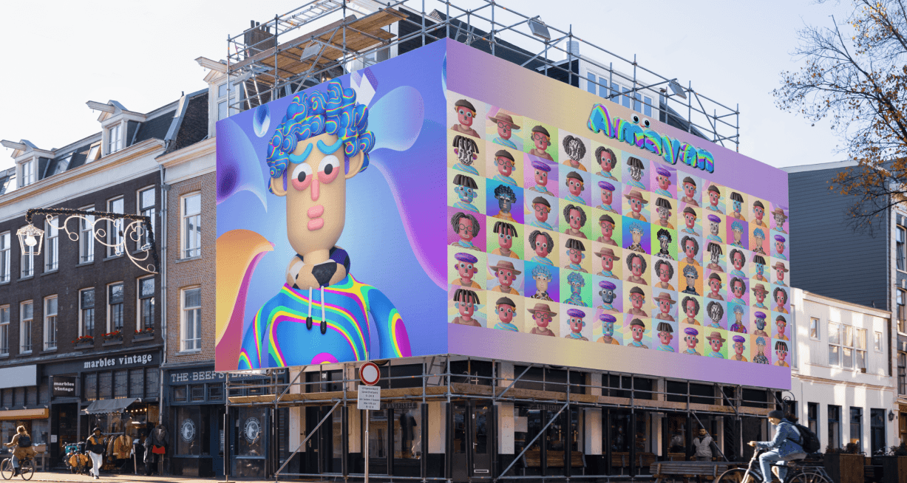
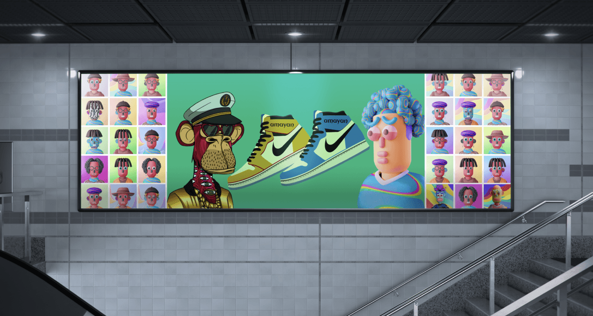
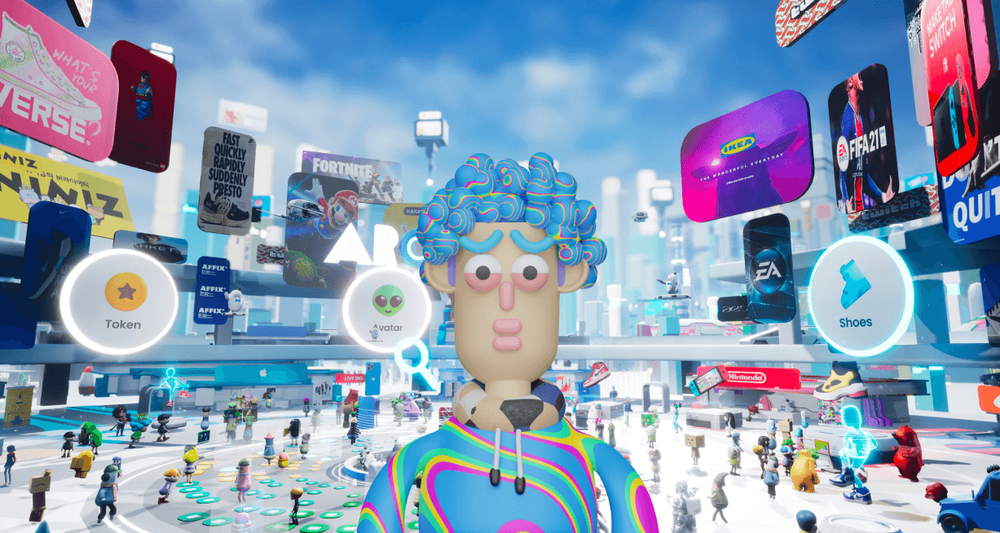
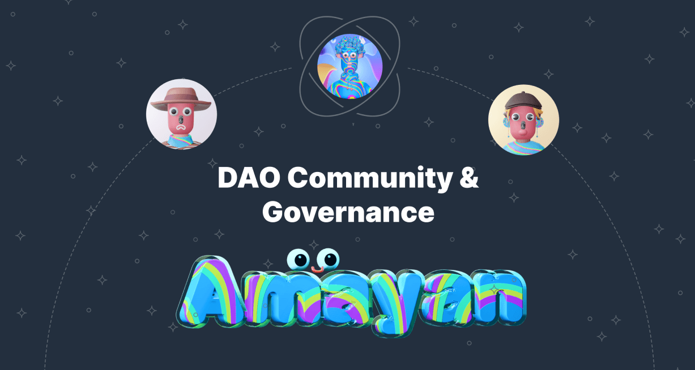
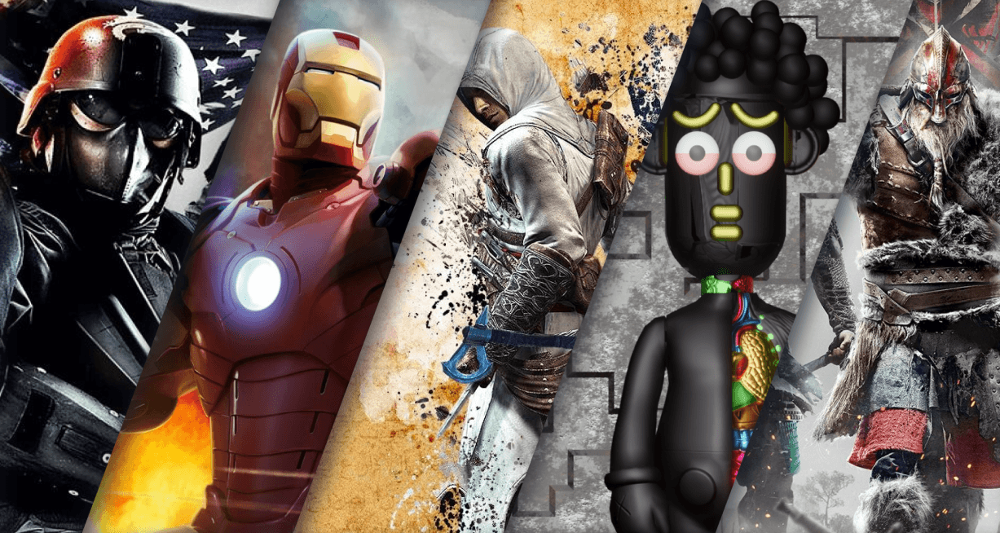
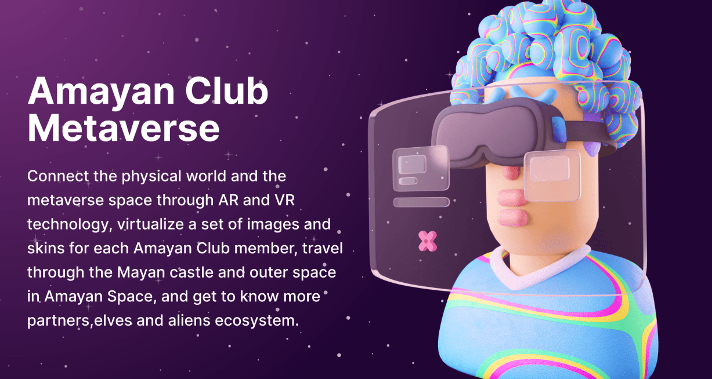

# Milestone

## Genesis
> Genesis NFT Collection

10,000 cross-border community spirits collided by Mayan civilization and modern trends, every lucky collector is a Genesis member of Amayan Club.

<h4>Club member benefits（continue to increase）</h4>

!> Social groups and parties

Enjoy the rights of Amayan Club online and offline parties、exhibitions、music festivals、street cultural activities,etc;

!> Prosperity with blue chips

You can use Amayan Club NFT derivative creation tools for free, and NFT blue-chip brands (BAYC, CryptoPunks, Meebits, CLONE X, Azuki, etc) or our recommended derivative scene templates to multiply and DIY new DNA NFTs;

!> All commercial rights & Royalties

The holder has complete community commercial rights, and can arbitrarily carry out secondary creation, derivative, processing, and realization of this NFT asset that belongs to you. You can also list NFTs on our trading market, and the brand will purchase your NFTs for physical production of derivatives, and will pay you royalties except for NFT sales;

!> NFT 3D Digital Pavilion

You can create your own NFT digital exhibition hall for free, and invite your friends to participate in your treasure party;

!> Game interaction, NFT entry GameFi

You can participate in games issued by our official and partners, implant your NFTs into our game scenarios, and participate in some liquidity rights of DeFi;

!> IP NFT ARK series

Enjoy the AirDrop plan of the ARK series derived from Amayan Space;

!> Community Governance

Enjoy the AirDrop plan of Amayan Club Token in the future;

> More rights to be disclosed, it is recommended to pay attention to the official announcement.

## Derivatives
> NFT Derivatives Tools and Trading Marketplace

Genesis NFT collectors can use the Amayan Club NFT derivative creation tool and trading market for free. The source NFT can not only be freely matched and combined with some derivative scenes (such as trendy clothing, fashion bags, hats, etc.), but also supports NFT blue-chip brands. ([BAYC](//opensea.io/collection/boredapeyachtclub), [CryptoPunks](//opensea.io/collection/cryptopunks), [Meebits](//opensea.io/collection/meebits), [CLONE X](//opensea.io/collection/clonex), [Azuki](//opensea.io/collection/azuki), etc.) and other secondary reproductions, minting coins and creating new DNA NFTs, one-stop sharing and listing to our Multi-Chain (priority support ETH chain, follow-up support BNB chain、SOL chain、Luna chain、Near chain, etc.) trading Marketplace.

In terms of NFT liquidity and commercial realization, we will also help users to implant NFTs into more commercial brands (such as FILA, GUCCI, Prada, Adidas, etc.), and all derivative NFTs can be sold on our trading market or [OpenSea](//opensea.io).

## Club-Gallery
> Club Independent IP and NFT Exhibition Gallery

Co-branded fashion artists release community independent IP images, and establish partnerships with apparel brands and art institutions.

Each member of Amayan Club enjoys the rights to re-derivation and creation, minting, and trading of all IP NFTs. At the same time, they will have their own digital exhibition hall (Amayan Gallery) to display their NFT works in multiple dimensions, like traveling to the beautiful Versailles Palace is as wonderful as the Louver.

## Governance
> DAO Community and AirDrop Plan

Amayan DAO Community Treasury and Committee Governance Plan

Amayan Space Derivatives ARK Series (AirDrop)

Amayan Club Token（In fact, we don't have this idea, but we will still open a vote in [Snapshot](//snapshot.org/#/amayan.eth) to decide whether to start this plan）

## NFT-Finance
> NFT Liquidity Equity

Amayan Game will cooperate with high-quality game project parties in the community to jointly evolve the Game-NFT-Social-Fi model, and help Amayan Club members' NFTs be transplanted into official and partner game scenarios, enabling more space for expression.

## Metaverse
> Application of NFT in Metaverse

Connect the physical world and the metaverse space through AR and VR technology, virtualize a set of images and skins for each Amayan Club member, travel through the Mayan castle and outer space in Amayan Space, and get to know more partners,elves and aliens ecosystem.